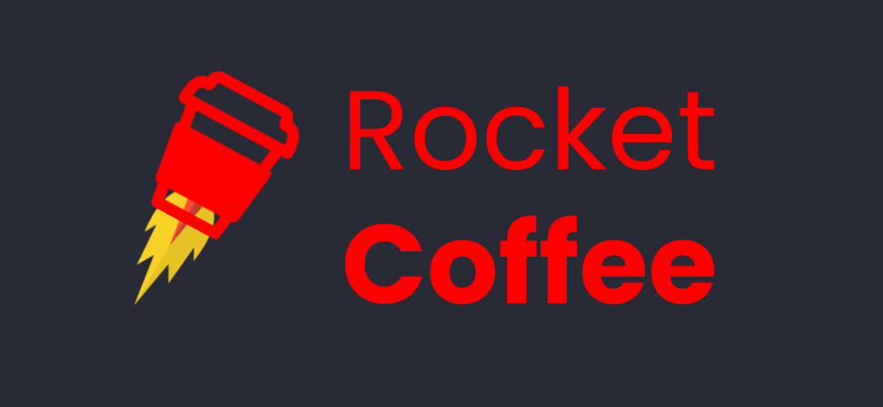

<p align="center">
   <h1></h1> 
</p>

## Technologies


 
 

 

<br/><br/>

## Instalation

<h3>Step 1:</h3>

```bash
npm install
# or
yarn
```
<h3>Step 2:</h3>

```bash
npm run dev
# or
yarn dev
```

## Objective:
<br/><br/>
## instructor:
[Mayk Brito](https://github.com/maykbrito) 
<br/><br/>

## References:
[RocketSeat](https://www.rocketseat.com.br/) 


